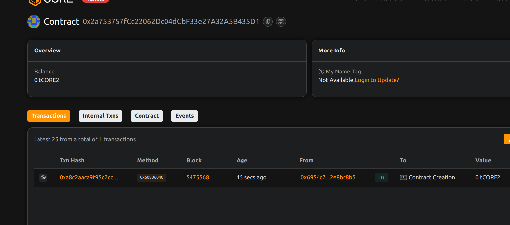

# CharityBridge: Transparent Donation Routing Across Multiple Chains

## Project Description
CharityBridge is a multi-chain donation platform that ensures complete transparency in charitable giving. It enables donors to contribute to verified charities across different blockchain networks while maintaining a clear audit trail of all transactions.

## Project Vision
Our vision is to create the most transparent and efficient cross-chain donation system that connects donors with verified charities worldwide. CharityBridge aims to eliminate opacity in charitable giving and maximize the impact of every contribution through blockchain technology.

## Key Features
- Multi-chain donation routing
- Verified charity registry
- Complete donation tracking
- Cross-chain transaction support
- Transparent fund allocation
- Donation history visibility

## Future Scope
- Automated currency conversion
- Recurring donation support
- Impact tracking integration
- DAO-based charity verification
- Donor reputation system
- Multi-signature fund release

## Contract Details
0x2a753757fCc22062Dc04dCbF33e27A32A5B435D1
